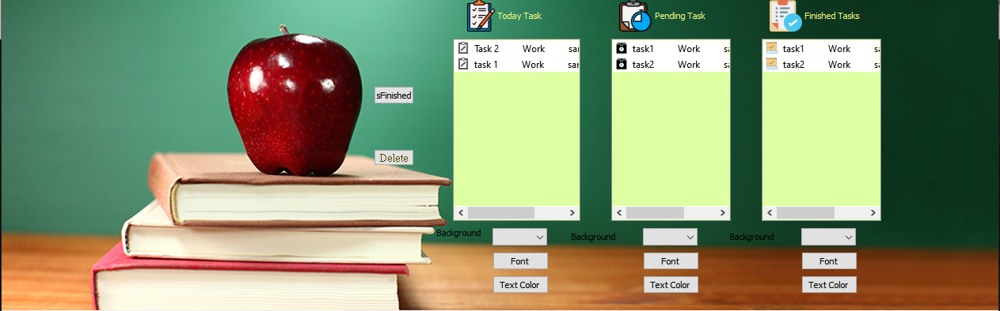
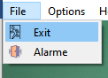
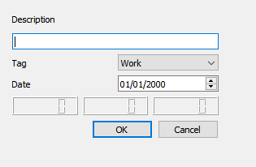
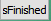
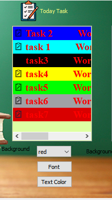
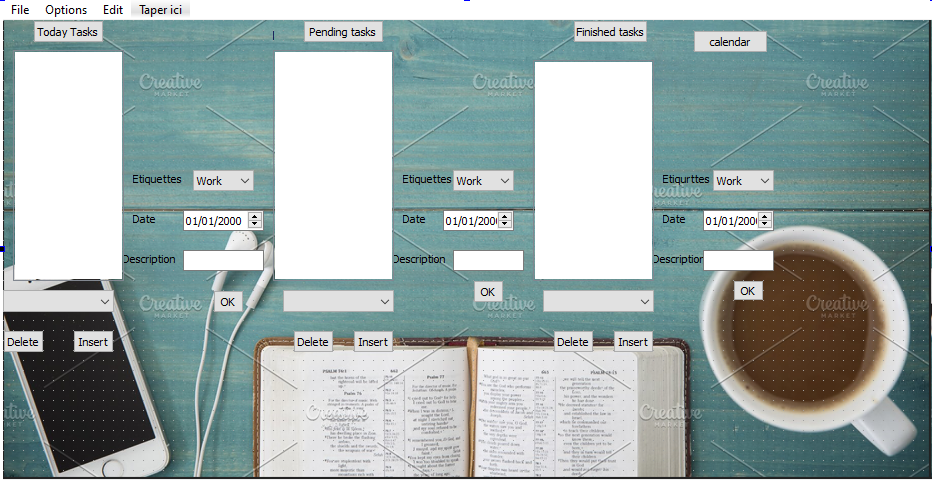
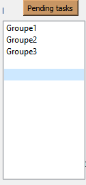
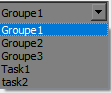
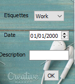

# todo
<h1 style="color:red">ToDo Application using  
            Containers  
</h1>

<p>Réalisé par EDDOUKS SALIMA  &  EDDOUKS OUMAYMA </p>


<p>• 
            A task is an object that represents some work that should be done. The task can tell you if the work is completed and if the operation returns a result.</p>

<h2 style=>Objectif :</h2>

<p> our  goal  is to create an application to manage our tasks. It  have all the features of main application such as menues, actions and toolbar.</p>
<h2>Using Item Based Model :</h2>


<p>.In this application the  user  is  able to close the application 
by clicking on the exit action
 </p>
 
 
 
```
void tasks::on_actionExit_triggered()
{

  QApplication::exit();
  write(this->filename);
  read(this->filename);
}

```

<p> and  create new tasks.
</p>
<p> When the user create a new task (new task , pending task or finished task), the application must pop up a dialog for the user to get those values:<br/>A description to stating the text and goal for the task <br/>A finished boolean indicating if the task is Finished or due.<br/>and a  Tag category to show the class of the task which is reduced to the following values:Work  ,Life and  Other.  then the the values will display at the list concerned  <p/>


<h3>dialog.cpp</h3>

```

#include "dialog.h"
#include "ui_dialog.h"

Dialog::Dialog(QWidget *parent) :
    QDialog(parent),
    ui(new Ui::Dialog)
{
    ui->setupUi(this);
}

Dialog::~Dialog()
{
    delete ui;
}

QString Dialog::get()const

{

    auto date=ui->dateEdit->date();
    auto a ="          ";
    return ui->lineEdit->text() +a+ ui->comboBox->currentText() +a+ date.toString();

}


```

<p>  The View of the main widget should be split in three areas:<br/>The first (en persistent) area shows the list of today tasks.<p/>


```

void tasks::on_actiontoday_task_triggered()
{
    Dialog f;
    
     auto reply =  f.exec();
     
     auto text = f.get();
     
     QString tmp{"C:\\Users\\UEMF\\Documents\\Tasks\\icon\\today task.png"};
     
     QIcon icon(tmp.arg(text));
     
     auto item = new QListWidgetItem(icon, text);
     
      item->setBackgroundColor(Qt::white);
 
    ui->listWidget1->addItem(item);
    
    write(this->filename);
    
    read(this->filename);
}

```

<p>  The second one is reserved for pending task (tasks for the future).<p/>


```
void tasks::on_actionpending_task_triggered()
{
    Dialog f;

     auto reply =  f.exec();

     auto text = f.get();

     QString tmp{"C:\\Users\\UEMF\\Documents\\Tasks\\icon\\pending task.png"};
     QIcon icon(tmp.arg(text));
     auto item = new QListWidgetItem(icon, text);

     item->setBackgroundColor(Qt::white);

ui->listWidget2->addItem(item);
write(this->filename);
read(this->filename);

}

```

<p> Finally, the third one shows the set of finished tasks. <p/>


```
void tasks::on_actionfinished_task_triggered()
{

    Dialog f;

     auto reply =  f.exec();
     auto text = f.get();
     QString tmp{"C:\\Users\\UEMF\\Documents\\Tasks\\icon\\finished task.png"};
     QIcon icon(tmp.arg(text));
     auto item = new QListWidgetItem(icon, text);


     item->setBackgroundColor(Qt::white);

ui->listWidget3->addItem(item);
write(this->filename);
read(this->filename);


}


```

<p> the  user  is  able also  to delete the tasks  by clicking on the button Delete<p/>


```

void tasks::on_Delete_clicked()
{
if(mnSelected1 != -1 ){
QListWidgetItem *it1 = ui->listWidget1->takeItem(mnSelected1);
delete it1;
ui->listWidget1->setCurrentRow(-1);
write(this->filename);
read(this->filename);
}
if(mnSelected2 != -1 ){
QListWidgetItem *it2 = ui->listWidget2->takeItem(mnSelected2);
delete it2;
ui->listWidget2->setCurrentRow(-1);
write(this->filename);
read(this->filename);
}
if(mnSelected3 != -1 ){
QListWidgetItem *it3 = ui->listWidget3->takeItem(mnSelected3);
delete it3;
ui->listWidget3->setCurrentRow(-1);
write(this->filename);
read(this->filename);

}


}


```

<p>  if a  user   finished  the task   he can add it  at  the list of finished tasks by clicking on the button isFinished <p/>


```

void tasks::on_isFinished_clicked()
{
    if(mnSelected1 != -1 ){
    QListWidgetItem *it1 = ui->listWidget1->takeItem(mnSelected1);

    ui->listWidget3->addItem(it1);
    write(this->filename);
    read(this->filename);
    }
    if(mnSelected2 != -1 ){
    QListWidgetItem *it2 = ui->listWidget2->takeItem(mnSelected2);

    ui->listWidget3->addItem(it2);
    write(this->filename);
    read(this->filename);
    }
    if(mnSelected3 != -1 ){
    QListWidgetItem *it3 = ui->listWidget3->takeItem(mnSelected3);

    ui->listWidget3->addItem(it3);
    write(this->filename);
    read(this->filename);

    }
}


```

<p>   the user can designe the  new tasks  specifying the Text color ,the backgrount and the Font.<p/>


```
void tasks::on_comboBox_1_activated(const QString &arg1)
{
    QListWidgetItem *item= ui->listWidget1->currentItem();
     if( ui->comboBox_1->currentText()=="red"){
    item->setBackgroundColor(Qt::red);
     }
     else if( ui->comboBox_1->currentText()=="Black"){
     item->setBackgroundColor(Qt::black);
     }
     else if( ui->comboBox_1->currentText()=="blue"){
     item->setBackgroundColor(Qt::blue);
     }
     }
     
     
```
```

void tasks::on_pushButton_3_clicked()
{
    QFont font("Times",15 ,QFont::Bold) ;
    QListWidgetItem *item= ui->listWidget2->currentItem();
    item->setFont(font);

}

void tasks::on_pushButton_2_clicked()
{
     QListWidgetItem *item= ui->listWidget1->currentItem();
     item->setTextColor(Qt::red);
}


```

<p>  Finaly The application must store an archive of all the pending and finished tasks.<br/>This is achieved thanks to the functions write()  and read() 
<p/>


```
void  tasks:: write(QString myfile){


for(auto i=0;i<ui->listWidget1->count();i++){

    QFile file(this->filename);

   if(!file.open(QFile::WriteOnly|QFile::Text)){
       qDebug()<<" ";
       return;
   }

QTextStream out (& file);

for(auto i=0;i<ui->listWidget1->count();i++){
    out<< ui->listWidget1->item(i)->text();
    out<<"\n";
}


for(auto i=0;i<ui->listWidget2->count();i++){
out<< ui->listWidget2->item(i)->text();
    out<<"\n";

}
for(auto i=0;i<ui->listWidget3->count();i++){
 out<< ui->listWidget3->item(i)->text();
    out<<"\n";

}
out<<"\n";
file.flush();
file.close();
}
}
            
            
```
```
            
void  tasks:: read(QString myfile){

QFile file(filename);

if(!file.open(QFile::ReadOnly|QFile::Text)){
    qDebug()<<" ";
    return;

QTextStream in (& file);
while(!in.atEnd()){

    QString line=in.readLine();
    if(!line.isEmpty()){

        auto splitLine=line.split("\t");
        QString status=splitLine[3].remove(0,10);
        QRegExp exp("(\\d{2})[/](\\d{2})[/](\\d{4})");

       exp.indexIn(line);
       auto dateString=exp.capturedTexts()[0].trimmed();
       if(status=="No"){
           auto dateList= dateString.split("/");
           auto date= QDate(dateList.at(2).toInt(),dateList.at(1).toInt(),dateList.at(0).toInt());
           if(date==QDate::currentDate())
               ui->listWidget1->addItem(line);
           else if(date>QDate::currentDate())
               ui->listWidget2->addItem(line);
           else
               ui->listWidget3->addItem(line);
       }
       else
           ui->listWidget3->addItem(line);
    }
}
 file.close();
}

}
            
            
```

<h2>Using MVC Model :</h2>

<p> the objetif in this version is the  same as the version of item based <br/>
the user here  is able to add new tasks  on the three lists by clicking on the button Today task ,Pending tasks or finished tasks.
  <p/>
  
  
```

void models::on_pushButton_7_clicked()
{
    //add1

    int row =model1->rowCount();
    model1->insertRows(row,1);
    QModelIndex index=model1->index(row);
    ui->listView->setCurrentIndex(index);
    ui->listView->edit(index);

}


```
<p> The tasks are displayed also  on the ComboBox<p/>


```
ui->comboBox->setModel(model1);

```
  
 <p>Or he can  enter those values:<br/>A description to stating the text and goal for the task  <br/>The Date <br/>A Tag category to show the class of the task which is reduced to the following values:Work  ,Life and  Other.<br/>Then he click at the batton ok to display the task on the list and  on the ComboBox.
<p/>



<h3>dialogue1.h</h3>

  
```

#ifndef DIALOGUE1_H
#define DIALOGUE1_H

#endif // DIALOGUE1_H
#include<QString>
#include<QtWidgets>

typedef struct S{
    QString Tag;
    QString Date;
    QString Description;

}S;
class dialogue1 : public QAbstractListModel {
private:
    QList<S>s;
public:
    dialogue1(QObject *parent={}): QAbstractListModel(parent){

    }
    ~dialogue1(){

    }
    int rowCount(const QModelIndex & parent) const{
        return s.count();
    }
    QVariant data(const QModelIndex & index, int role)const{
        if (role==Qt::DisplayRole){
            return s[index.row()].Description +"\t"+s[index.row()].Date+"\t"+ s[index.row()].Tag;
        }
        return QVariant();
    }

   void ok(S & e){
       beginInsertRows({},s.count(),s.count());
       s.append(e);
       endInsertRows();

    }
};


```

```

void models::on_pushButton_13_clicked()
{
    S t2;
    t2.Date=(ui->dateEdit_2->date()).toString();
    t2.Description=ui->lineEdit_2->text();
   t2.Tag= ui->comboBox_5->currentText();
 model6.ok(t2);
 ui->listView_2->setModel(&model6);

 ui->comboBox_2->setModel(&model6);


}


```

<p>on this version the user also can delete and  insert the tasks <p/>


```

void models::on_pushButton_clicked()
{

    //delete1

    model1->removeRows(ui->listView->currentIndex().row(),1);
}

```

```

void models::on_pushButton_5_clicked()
{
    //insert1
    int row =ui->listView->currentIndex().row();
    model1->insertRows(row,1);
    QModelIndex index= model1->index(row);
    ui->listView->setCurrentIndex(index);
    ui->listView->edit(index);
}

```
<p> Mr.Anass BELCAID <p/>
<p>Merci pour votre soutient.<p/>
